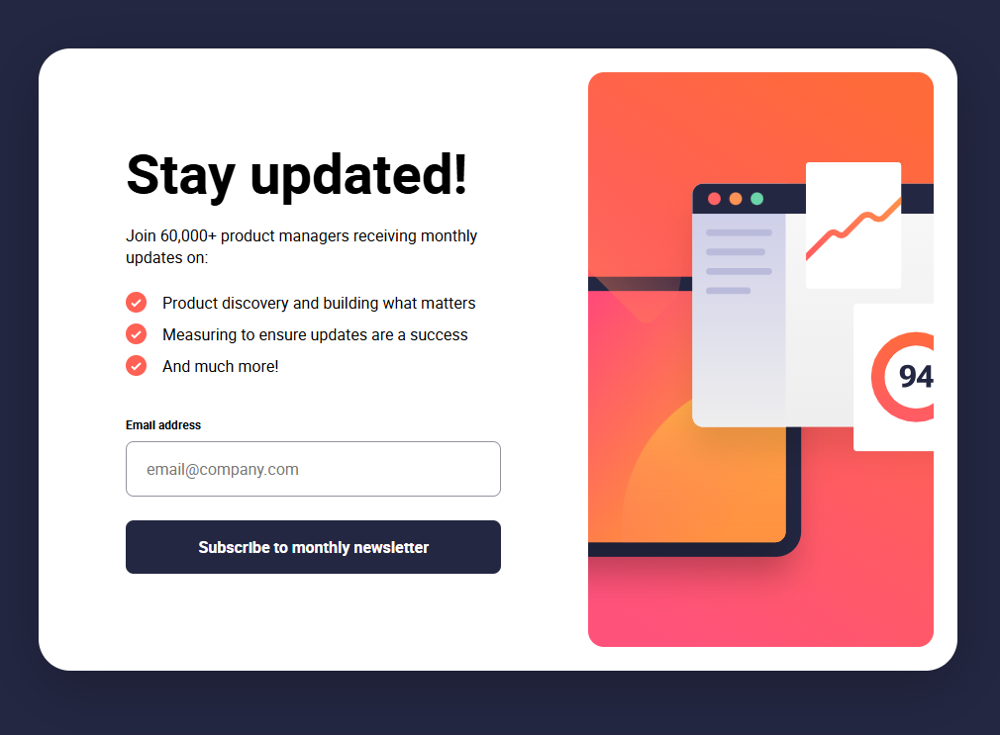

# Frontend Mentor - Newsletter sign-up form with success message solution

This is a solution to the [Newsletter sign-up form with success message challenge on Frontend Mentor](https://www.frontendmentor.io/challenges/newsletter-signup-form-with-success-message-3FC1AZbNrv). Frontend Mentor challenges help you improve your coding skills by building realistic projects.

## Table of contents

-   [Overview](#overview)
    -   [The challenge](#the-challenge)
    -   [Screenshot](#screenshot)
    -   [Links](#links)
-   [My process](#my-process)
    -   [Built with](#built-with)
    -   [Useful resources](#useful-resources)
-   [Author](#author)

## Overview

### The challenge

Users should be able to:

-   Add their email and submit the form
-   See a success message with their email after successfully submitting the form
-   See form validation messages if:
    -   The field is left empty
    -   The email address is not formatted correctly
-   View the optimal layout for the interface depending on their device's screen size
-   See hover and focus states for all interactive elements on the page

### Screenshot

### Links

-   Solution: [Github repo](https://github.com/morauszkia/fm-newsletter-signup/)
-   Live Site URL: [@Github Pages](https://morauszkia.github.io/fm-newsletter-signup/)

## My process

### Built with

-   Semantic HTML5 markup
-   CSS custom properties
-   Flexbox
-   Mobile-first workflow
-   Using responsiveness best practices (units, sizing, etc.)
-   Media queries
-   Vanilla JavaScript for interactivity

### Useful resources

-   [Josh Comeau about Debouncing](https://www.joshwcomeau.com/snippets/javascript/debounce/)

## Author

-   Frontend Mentor - [@mantis](https://www.frontendmentor.io/profile/morauszkia)
-   X - [@mantis_hu86](https://x.com/mantis_hu86)
-   Github -[@mantis](https://github.com/morauszkia)
-   LinkedIn - [András Morauszki](https://www.linkedin.com/in/andras-morauszki/)
